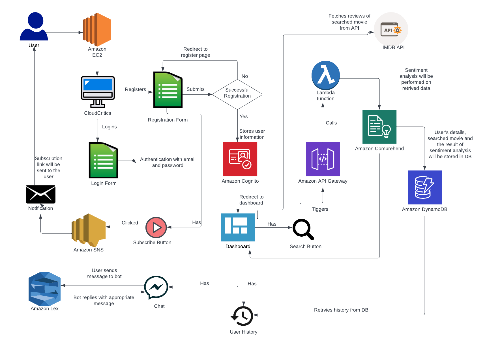
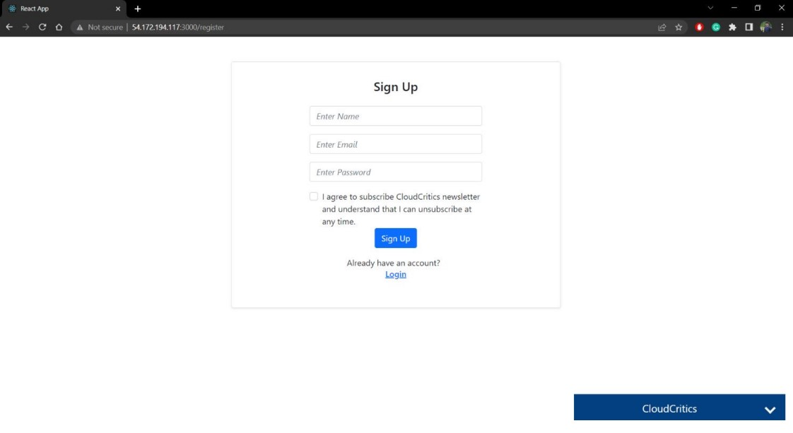
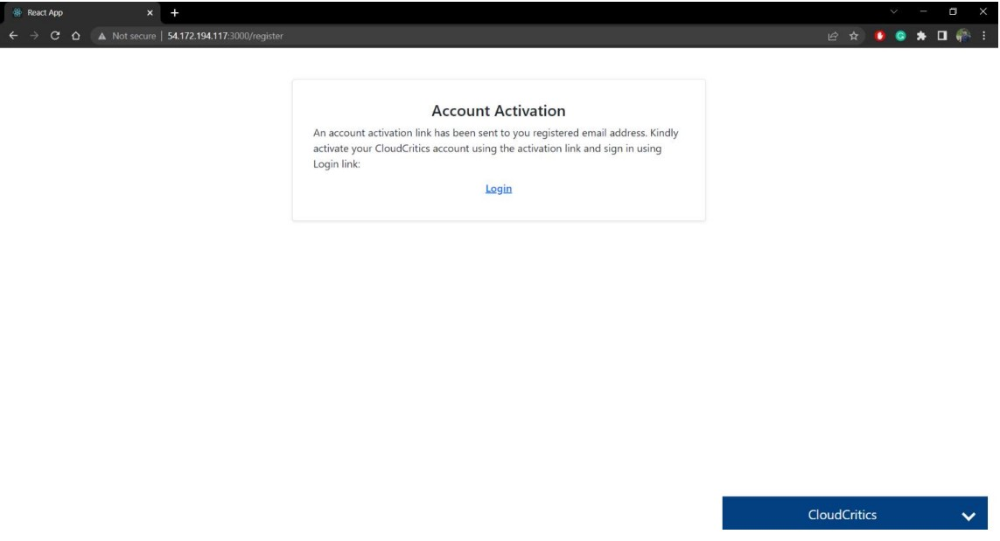
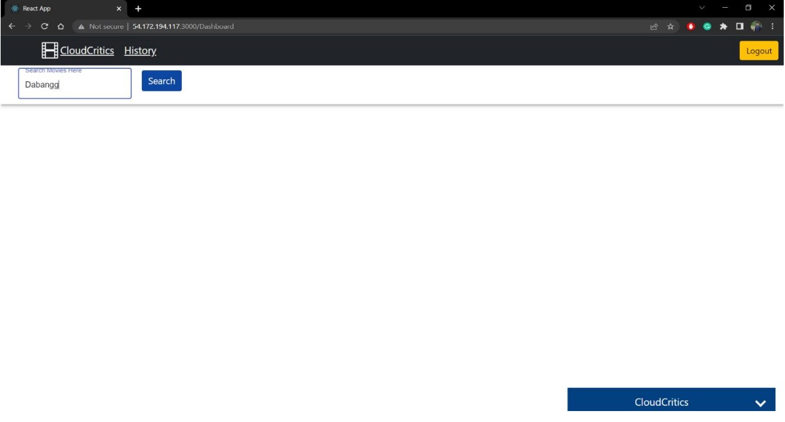
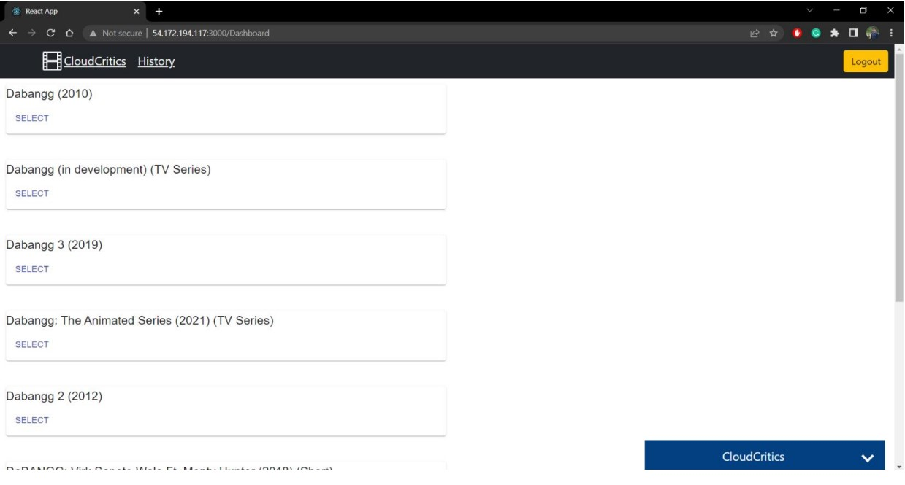
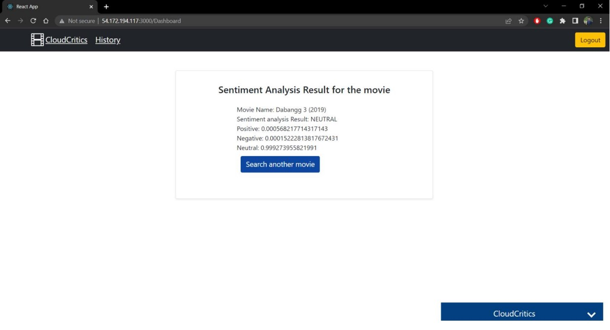
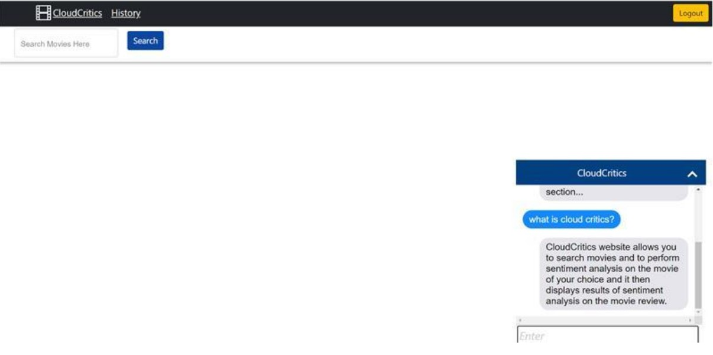

# Entertainment-Finder-And-Sentiment-Analysis - CloudCritics

## Application Flow
- Implemented a total of 8 AWS Services to build the web application. 
- Used AWS EC2 to host the web application as it delivers secure, reliable, and highperformance compute infrastructure. User accesses our app through the web browser
- Our web application uses AWS Cognito to authenticate the user. Users can also register themselves by providing their name, email, and password. 
- While registering if the user opts to enroll for receiving CloudCritics Newsletter Subscription then an email for the subscription will be sent to him through AWS SNS. When the user opts to subscribe to the newsletter the API Gateway Endpoint that triggers the AWS Lambda function to subscribe newsletter is called which uses the AWS SNS service to send the subscription email. 
- Cognito stores this data in User Pool. Upon authenticated successfully user is redirected to the dashboard of the application
- The user can interact with the chat bot which is implemented using AWS Lex. The user can ask for information regarding the CloudCritics website and the chatbot will respond to him with an appropriate answer
- If the user wants to get the reviews of a particular movie, then he needs to search the movie using the name through the search box. Searching the movie name triggers the underlying IMDB Movie API which returns the names of the movies based on the movie name provided by the user in the movie search box
- The user can then select the movie on which he wants to perform sentiment analysis and then the IMDB Movie API fetches the reviews of that movie. The review data is then sent to API Gateway Endpoint which triggers the AWS Lambda function that performs the sentiment analysis using AWS Comprehend. 
- This Lambda function also stores the results of sentiment analysis on the movie review data in the DynamoDB. The user can view his search history which is directly fetched from the AWS DynamoDB.

- Application Architecture

- Landing/Login page\

- Successful activation of user\

- Search movies or television shows by keywords\

- Search result - displaying all the movies and shows based on user search by fetching data from IMDB API\

- Sentiment analysis result on the selected entertainment\

- Chatbot created using AWS Lex\

